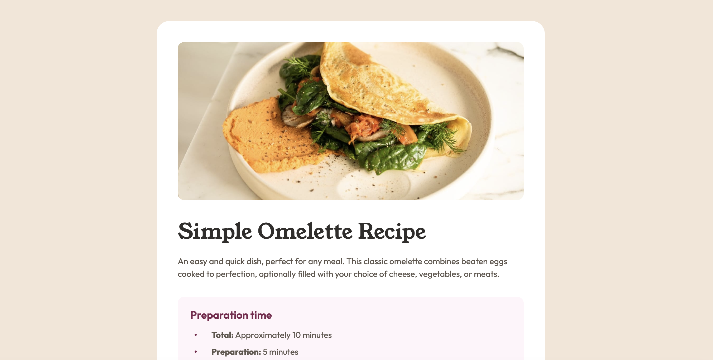

# Frontend Mentor - Recipe page solution

This is a solution to the [Recipe page challenge on Frontend Mentor](https://www.frontendmentor.io/challenges/recipe-page-KiTsR8QQKm). Frontend Mentor challenges help you improve your coding skills by building realistic projects. 

## Table of contents

- [Overview](#overview)
  - [The challenge](#the-challenge)
  - [Screenshot](#screenshot)
  - [Links](#links)
- [My process](#my-process)
  - [Built with](#built-with)
- [Author](#author)

## Overview

### Screenshot

### Links

- Solution URL: [Jason-Donmoyer/RECIPE-PAGE](https://github.com/Jason-Donmoyer/RECIPE-PAGE)
- Live Site URL: [RECIPE-PAGE](https://jason-donmoyer.github.io/RECIPE-PAGE/)

## My process

### Built with

- Semantic HTML5 markup
- CSS custom properties
- Flexbox
- Mobile-first workflow
r for yourself when you look back on this project in the future.**

## Author

- Frontend Mentor - [@Jason-Donmoyer](https://www.frontendmentor.io/profile/Jason-Donmoyer)
